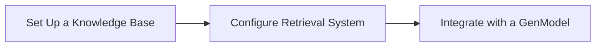
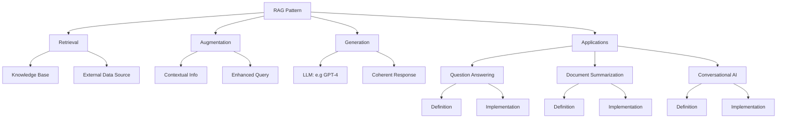

# Retrieval-Augmented Generation (RAG) pattern - Overview

<b>List of References </b> (Click to expand)

- [What's Azure AI Search?](https://learn.microsoft.com/en-us/azure/search/search-what-is-azure-search)
- [Indexer overview - Azure AI Search](https://learn.microsoft.com/en-us/azure/search/search-indexer-overview)
- [Field mappings and transformations using Azure AI Search indexers](https://learn.microsoft.com/en-us/azure/search/search-indexer-field-mappings)
- [Azure AI Search Sample Data](https://github.com/Azure-Samples/azure-search-sample-data/tree/main)
- [Add scoring profiles to boost search scores](https://learn.microsoft.com/en-us/azure/search/index-add-scoring-profiles)
- [Relevance in keyword search (BM25 scoring)](https://learn.microsoft.com/en-us/azure/search/index-similarity-and-scoring)
- [Tips for better performance in Azure AI Search](https://learn.microsoft.com/en-us/azure/search/search-performance-tips)
- [Retrieval Augmented Generation (RAG) in Azure AI Search](https://learn.microsoft.com/en-us/azure/search/retrieval-augmented-generation-overview)
- [Service limits in Azure AI Search](https://learn.microsoft.com/en-us/azure/search/search-limits-quotas-capacity)
- [Semantic ranking in Azure AI Search](https://learn.microsoft.com/en-us/azure/search/semantic-search-overview)
- [Create a skillset in Azure AI Search](https://learn.microsoft.com/en-us/azure/search/cognitive-search-defining-skillset)
- [Skillset concepts in Azure AI Search](https://learn.microsoft.com/en-us/azure/search/cognitive-search-working-with-skillsets)
- [Custom AML skill in skillsets - Azure AI Search](https://learn.microsoft.com/en-us/azure/search/cognitive-search-aml-skill)
- [OCR skill - Azure AI Search](https://learn.microsoft.com/en-us/azure/search/cognitive-search-skill-ocr)
- [Custom Web API skill in skillsets - Azure AI Search](https://learn.microsoft.com/en-us/azure/search/cognitive-search-custom-skill-web-api)
- [Language detection cognitive skill - Azure AI Search](https://learn.microsoft.com/en-us/azure/search/cognitive-search-skill-language-detection)
- [Entity Recognition cognitive skill (v3) - Azure AI Search](https://learn.microsoft.com/en-us/azure/search/cognitive-search-skill-entity-recognition-v3)
- [Key Phrase Extraction cognitive skill - Azure AI Search](https://learn.microsoft.com/en-us/azure/search/cognitive-search-skill-keyphrases)
- [Image Analysis cognitive skill - Azure AI Search](https://learn.microsoft.com/en-us/azure/search/cognitive-search-skill-image-analysis)
- [Text split skill - Azure AI Search](https://learn.microsoft.com/en-us/azure/search/cognitive-search-skill-textsplit)
- [AI Search by sku limits/quota](https://learn.microsoft.com/en-us/azure/search/search-limits-quotas-capacity)

## Overview

| **Step**       | **Definition** | **Implementation with Azure** |
|----------------|----------------|-------------------------------|
| **Retrieval**  | Retrieval involves searching and extracting relevant documents or data from a knowledge base or external data source based on the input query. | Use Azure AI Search to index and query documents stored in Azure Storage Blob Containers. Configure the search index to perform semantic search and return the most relevant results. |
| **Augmentation** | Augmentation involves enhancing the input query with the retrieved information to provide additional context and details. | Use Azure AI Search skillsets to preprocess the retrieved data, extracting key phrases, entities, and contextual information. This augmented input is then used to inform the generative model. |
| **Generation** | Generation involves using a generative model to process the augmented input and produce a coherent and contextually relevant response. | Deploy a generative model like GPT-4 on Azure AI Foundry. Use an Azure Function App to orchestrate the data flow, calling the Azure AI Foundry model API to generate responses based on the augmented input. |

> Implementing RAG Pattern with Azure AI:

1. **Set Up a Knowledge Base**: Store your documents in Azure Storage Blob Containers or another accessible data source.
2. **Configure a Retrieval System**: Use Azure AI Search to index and retrieve relevant documents based on user queries.
3. **Integrate with a Generative Model**: Use a generative model like GPT-4 to process the retrieved documents and generate responses.

> Traditional methods, `Retrieval-Augmented Generation (RAG)`, and `Agentic RAG`:

| **Aspect** | **Traditional Methods** | **RAG Pattern** | **Agentic RAG** |
|---|---|---|---|
| **Model Behavior** | Generates from fixed, pre-trained knowledge and a single prompt. | Grounds generation with retrieved context at response time. | Plans multi-step work, chooses tools, and iterates until it can complete or escalate a task. |
| **Data Freshness** | Knowledge can become outdated until the model is retrained. | Retrieves current information from connected, approved sources. | Decides when to retrieve, refresh, or query additional systems as the task evolves. |
| **Context Understanding** | Uses only the prompt and its learned knowledge. | Adds relevant documents to the prompt for richer, evidence-based responses. | Maintains task state and can refine the question, gather missing context, and verify intermediate results. |
| **Retrieval Techniques** | Commonly relies on keyword search or manually supplied content. | Uses keyword, vector, hybrid, and semantic search to find relevant content. | Uses retrieval as one tool among many, selecting sources and repeating searches when the evidence is insufficient. |
| **Accuracy and Grounding** | May produce plausible but unsupported answers. | Improves grounding by citing retrieved, trusted content. | Can validate outputs with retrieval, tools, policies, or human approval before taking an action. |
| **Hallucination Risk** | Higher because answers rely mainly on model training data. | Lower when retrieval sources are relevant, current, and trusted. | Further reduced through tool-result validation, bounded actions, and explicit escalation for uncertain cases. |
| **Flexibility** | Best for narrow, well-defined prompts and static workflows. | Supports knowledge-intensive question answering, summarization, and conversational experiences. | Supports multi-step workflows such as research, triage, case resolution, and coordinated system actions. |
| **Adaptability** | Requires prompt changes, fine-tuning, or retraining to change behavior. | Adapts to new content by updating the retrieval corpus. | Adapts its plan and tool sequence to the task while operating within defined instructions and permissions. |
| **Cost Efficiency** | Can require expensive retraining and large labeled datasets for updates. | Avoids frequent retraining by reusing a managed knowledge corpus. | Adds orchestration and tool-call cost, but can control spend through limits, caching, and early task completion. |
| **Governance** | Primarily governed through model selection, prompts, and content controls. | Adds source curation, access controls, citations, and retrieval evaluation. | Requires tool permissions, action guardrails, audit logs, approval gates, and evaluation of both reasoning and actions. |
| **Applications** | Basic search, static content generation, and narrow automation. | Grounded customer support, enterprise search, document summarization, and knowledge assistants. | Research assistants, service operations, incident triage, workflow automation, and human-in-the-loop business processes. |

## Applications of RAG Pattern

<b>Question Answering</b>

> Providing accurate answers by retrieving relevant documents and generating responses based on them.

- **Implementation**:
  - **Retrieval**:
    - Use Azure AI Search to index a large corpus of documents, such as research papers, articles, or FAQs.
    - Perform semantic search to retrieve the most relevant documents based on the query.
  - **Augmentation**: Extract key information from the retrieved documents using Azure AI Search skillsets (key phrase extraction, entity recognition, language detection).
  - **Generation**:
    - Use Azure AI Foundry to generate a coherent and contextually relevant answer by processing the augmented input.
    - Orchestrate the data flow using Azure Function App.

<b>Document Summarization</b>

> Summarizing documents by retrieving key sections and generating concise summaries.

- **Implementation**:
  - **Retrieval**:
    - Use Azure AI Search to index documents such as reports, articles, and books.
    - Retrieve the most relevant sections of the document based on the summary request.
  - **Augmentation**: Identify key sentences, paragraphs, and sections using Azure AI Search skillsets.
  - **Generation**:
    - Use Azure AI Foundry to generate a concise summary by processing the augmented input.
    - Orchestrate the data flow using Azure Function App.

<b>Conversational AI</b>

> Enhancing chatbot responses with up-to-date information from external sources.

- **Implementation**:
  - **Retrieval**:
    - Use Azure AI Search to index a knowledge base containing FAQs, support articles, and user manuals.
    - Retrieve the most relevant documents based on the conversation.
  - **Augmentation**: Extract key information from the retrieved documents using Azure AI Search skillsets (answers to common questions, troubleshooting steps, product details).
  - **Generation**:
    - Use Azure AI Foundry to generate coherent and contextually relevant chatbot responses by processing the augmented input.
    - Orchestrate the data flow using Azure Function App.

